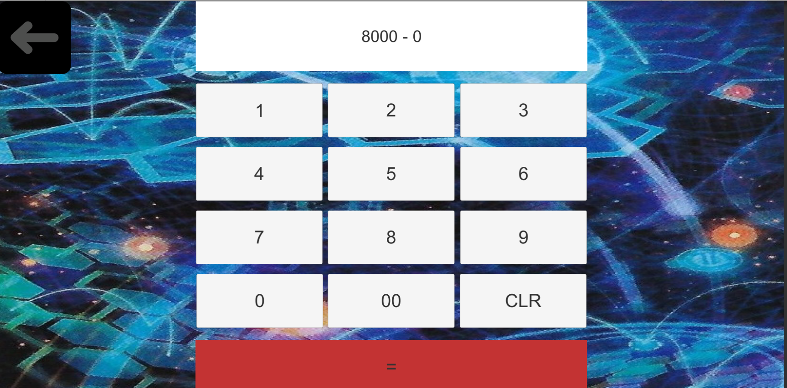

# YugiohApp

Date du projet : 2020/05/1

## Contributeur : 
Ludovic Lefevre

## Bases du projet :
crée une application ayant pour but d'aider les joueur de Yu-gi-oh pendant leurs partie a compter leur points de vie, connaitre le temps restant de la manche, lancer un de ou une pièce 

## Mise a jour possible :

- Empêcher la mise en vielle de l'appareil (comme pour une vidéo)
- refaire la charte graphique pour donner une vraie identité à l'application
- proposer une option pour importer l'image de son deck

## Credit :

- 2020 studio Dice/SHUEISHA, TV TOKYO, KONAMI

